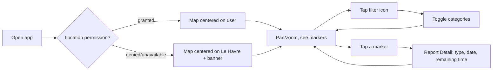

# Safety Doggy — User Journeys & Navigation

| Item | Detail |
|---|---|
| Document version | 1.0 |
| Status | Draft — awaiting your confirmation before Step 3 (HTML prototype) |
| Source of truth | `../02-product-vision/product-vision-and-functional-specs.md` (all FR-x.x references below point there) |
| Companion document | `screen-specifications.md` — every screen's content and states in detail |

---

## 1. Navigation Paradigm

**Decision: map-centric, no bottom tab bar.** The map is the permanent root screen. Everything else — filters, report detail, creation, profile — is reached via floating controls on top of the map, and opens as a bottom sheet (partial overlay, map stays visible) or a full screen (map is replaced), never as a tab.

**Why:** The spec's own success criteria are blunt about this — "fast map access, no account required, available at app startup" (critical) and "3 taps or fewer" to report (critical). A tab bar spends permanent screen space on destinations (Profile, History) that most sessions never visit, and implies the map is one of several equally-important sections rather than the product itself. Waze, the spec's own reference point, uses exactly this pattern: map as home, everything else as an overlay on top of it.

**Floating controls on the Map screen (always visible, regardless of login state):**
- **Filter icon** (top-left) → opens Category Filter bottom sheet.
- **Account icon** (top-right) → opens Profile (if logged in) or Auth Landing (if visitor).
- **Language icon** (top-right, next to account icon) → opens Language Switcher bottom sheet. Present for visitors too — resolves the FR-12.1 placement gap from Step 1.
- **Report button** (bottom-right, floating action button, most prominent) → opens Report Creation (logged in + verified) or Auth Landing (otherwise), per FR-6.1.

---

## 2. Screen & Component Inventory

| ID | Name | Type | Reached from | Auth required |
|---|---|---|---|---|
| S1 | Splash | Full screen (transient) | App cold start | No |
| S2 | Map (Home) | Full screen (root) | App start, back from anywhere | No |
| C1 | Category Filter | Bottom sheet | Map: filter icon | No |
| C2 | Report Detail | Bottom sheet | Map: tap a marker | No (actions inside require login) |
| G1 | Language Switcher | Bottom sheet | Map: language icon, or Profile | No |
| S3 | Auth Landing | Full screen | Map: report FAB or account icon (visitor) | No |
| S4 | Sign Up (email) | Full screen | S3 | No |
| S4b | Nickname Prompt | Full screen (one-time) | Right after first successful sign-up/login | Yes (just created) |
| S5 | Login (email) | Full screen | S3 | No |
| S6 | Forgot Password | Full screen | S5 | No |
| S7 | Email Confirmation Pending | Full screen / inline state | After sign-up, or when reporting unconfirmed | Yes (unconfirmed) |
| S8 | Report Creation | Full screen | Map: report FAB (logged in + verified) | Yes |
| M2 | Duplicate Confirmation | Modal | S8: on submit, if duplicate found | Yes |
| T1 | Report Created | Toast (transient) | S8: after successful submit | Yes |
| S9 | Profile / Account | Full screen | Map: account icon (logged in) | Yes |
| S10 | Edit Nickname | Inline section within S9 | S9 | Yes |
| S11 | Report History | Full screen | S9 | Yes |
| M3 | Delete Report Confirmation | Modal | C2: delete action | Yes |
| M4 | Delete Account Confirmation | Modal | S9: delete account | Yes |
| S12 | Terms of Use | Full screen | S3, S4, S9, S12/S13 cross-links | No |
| S13 | Privacy Policy | Full screen | S3, S4, S9, S12/S13 cross-links | No |
| X1 | Suggest a Report Type | External (mailto) | S8 | No |
| E1 | Network Error (map) | Inline banner state | Overlays S2 | No |
| E2 | Retry Error (forms) | Inline banner state | Overlays S8 / S4 / S5 | Depends on screen |

---

## 3. Navigation Map

```mermaid
flowchart TD
    S1[Splash] --> S2[Map - Home]

    S2 -- filter icon --> C1[Category Filter]
    S2 -- tap marker --> C2[Report Detail]
    S2 -- language icon --> G1[Language Switcher]
    S2 -- account icon, visitor --> S3[Auth Landing]
    S2 -- account icon, logged in --> S9[Profile]
    S2 -- report FAB, visitor --> S3
    S2 -- report FAB, logged in+verified --> S8[Report Creation]
    S2 -- report FAB, logged in unverified --> S7[Email Confirmation Pending]

    S3 -- sign up with email --> S4[Sign Up]
    S3 -- log in --> S5[Login]
    S3 -- continue with Google --> S4b[Nickname Prompt]
    S3 -.-> S12[Terms of Use]
    S3 -.-> S13[Privacy Policy]

    S4 -- success --> S4b
    S4 -- unconfirmed email --> S7
    S5 -- success, confirmed --> S2
    S5 -- success, unconfirmed --> S7
    S5 -- forgot password --> S6[Forgot Password]
    S6 --> S5

    S4b -- skip or save --> S2

    S7 -- confirms email --> S2

    C2 -- extend --shown to creator--> C2
    C2 -- flag --shown to others--> C2
    C2 -- delete --shown to creator--> M3[Delete Report Confirm]
    M3 -- confirm --> S2

    S8 -- submit, no duplicate --> T1[Report Created] --> S2
    S8 -- submit, duplicate found --> M2[Duplicate Confirm]
    M2 -- publish anyway --> T1
    M2 -- cancel --> S8
    S8 -.-> X1[Suggest a Report Type]

    S9 -- report history --> S11[Report History]
    S9 -- edit nickname --> S10[Edit Nickname]
    S9 -- delete account --> M4[Delete Account Confirm]
    S9 -- language --> G1
    S9 -.-> S12
    S9 -.-> S13
    M4 -- confirm --> S2

    S11 -- tap own report --> C2
```

---

## 4. Design Decisions Made This Step (flagged for your review, not blocking)

Consistent with Step 1, here are UX-level calls I made to resolve things the functional spec left open. These are design judgment, not new product/legal trade-offs — I'm flagging them so you can override if any feel wrong, but I don't think they need a formal sign-off the way the Step 1 items did.

| Decision | Rationale |
|---|---|
| **Report Creation is one screen**, not a multi-step wizard: type grid + mini-map with draggable pin + duration (auto-shown) + submit, all in one scroll. | Directly serves the spec's own critical requirement — "3 taps or fewer from the map" (tap FAB → tap type → tap Submit, if the pre-filled GPS pin doesn't need adjustment). |
| **Age confirmation (16+) and Terms acceptance are both single checkboxes on the Auth Landing screen (S3)**, gating both the email sign-up button and the "Continue with Google" button — not embedded only in the email sign-up form. | The spec described these under the email sign-up flow specifically, but Google sign-in has no form step of its own to attach a checkbox to. Putting both gates on the landing screen covers both paths identically with no separate Google-specific interstitial. |
| **Nickname prompt (S4b) is a distinct one-time screen right after first successful sign-up/login**, with a visible "Skip" action, rather than a field on the sign-up form itself. | Matches the spec's literal wording ("nickname requested at first login") and keeps the sign-up form itself minimal (email + password + two checkboxes only) — fewer fields between a visitor and their first report. |
| **No bottom tab bar** (see §1). | Explained above — matches the map-first, minimal-taps product intent. |
| **Language switcher is a bottom sheet reachable from the map itself**, not buried only in Profile. | Resolves the FR-12.1 gap: visitors have no profile screen, but should still be able to switch language. |
| **Report expiring while its detail card is open (FR-4.5):** the card's action buttons (Extend/Delete/Flag) disable immediately and a small inline note ("This report has expired") replaces them; the card does not force-close. | Keeps the user in place rather than yanking a screen out from under them, while making it unambiguous that no further action is possible. |
| **Marker clustering:** when multiple markers are close enough to overlap at the current zoom level, they combine into a single cluster marker showing a count; tapping zooms in rather than opening a detail card. | Standard, well-understood map pattern — avoids an unreadable stack of icons without inventing a custom interaction. |

---

## 5. User Journeys

### 5.1 Visitor — Core Loop (browse)



Covers: FR-1.2, FR-1.3, FR-2.1–2.5, FR-3.1–3.3, FR-4.1.

**Edge case — no connectivity (FR-2.6):** Step "Pan/zoom, see markers" instead shows the last-rendered map with an inline banner ("Can't load reports — check your connection") and a retry action. Browsing the base map still works; report data does not update until connectivity returns.

### 5.2 Visitor — Attempts to Report

1. Visitor taps the Report FAB (S2).
2. Redirected straight to Auth Landing (S3) — no interstitial banner first (FR-6.1).
3. Sees "An account keeps reports accountable," a login option, a sign-up option, and the age/Terms checkboxes.
4. If they abandon here (back button), they land back on the Map exactly where they left it — no data lost, since nothing was entered yet.

### 5.3 New Contributor — Sign Up (Email) → First Report

1. From Auth Landing (S3), visitor checks "I'm 16+" and "I accept the Terms," taps "Sign up with email."
2. Sign Up screen (S4): email + password.
3. **Edge case (FR-6.2):** email already registered → inline error with a "log in instead" link back to S5, no data loss on the rest of the form is moot since only email/password exist.
4. Submits → confirmation email sent → Nickname Prompt (S4b): optional field, "Skip" or "Save" both proceed to the Map (S2).
5. Taps Report FAB → since email isn't confirmed yet, redirected to Email Confirmation Pending (S7) instead of the report form (FR-6.4). Sees "Resend confirmation email" action.
6. Confirms email (external, via emailed link) → returns to the app → Map (S2).
7. Taps Report FAB again → now allowed through to Report Creation (S8).
8. Selects a type, confirms/adjusts the GPS-prefilled pin (within the ~30km launch-area cap), taps Submit.
9. **Edge case (FR-7.3):** if a same-type report exists within 50m → Duplicate Confirmation modal (M2) — "publish anyway" or "cancel and go back."
10. Report Created toast (T1) → back to Map (S2), centered on the new marker.

### 5.4 New Contributor — Sign Up via Google

1. From Auth Landing (S3), checks the two gate boxes, taps "Continue with Google."
2. Google's native OAuth flow runs.
3. **Edge case (FR-6.5):** user cancels or it fails → returned to S3 unchanged, no partial account, no confusing error.
4. Success (first time) → Nickname Prompt (S4b) → Map (S2). Google accounts' email is provider-verified, so **no S7 email-confirmation gate applies** — they can report immediately (confirmed decision, see §6).

### 5.5 Returning Contributor — Extend / Delete / Flag a Report

- **Extend (own report):** Map → tap own marker → Report Detail (C2) shows "Extend duration" → tap → duration resets, toast confirms, sheet stays open showing updated remaining time (FR-4.4).
- **Delete (own report):** Map → tap own marker → C2 shows "Delete" → tap → Delete Report Confirmation (M3) → confirm → marker removed from map for everyone, sheet closes (FR-8.2).
- **Flag (someone else's report):** Map → tap another user's marker → C2 shows "Flag as incorrect" (only if logged in; visitors see detail only) → tap → button disables, shows "Flagged — thanks," no further UI (FR-5.1).

### 5.6 Returning Contributor — Session Expires Mid-Report

1. User is filling out Report Creation (S8) with a stale session.
2. Taps Submit → server rejects due to expired auth.
3. Redirected to Login (S5) with a brief note ("Please log in again to finish your report"); selected type and pin position are held in memory.
4. On successful login, returned to S8 with the same type/pin still selected, ready to submit (FR-6.9).
5. **If state genuinely can't be preserved** (technical constraint discovered during build): user is told plainly why they're back at the start of the form, not silently reset.

### 5.7 Returning Contributor — Forgot Password

1. Login (S5) → "Forgot password?" → Forgot Password (S6).
2. Enters email → reset link sent → follows link outside the app → sets new password → returns to Login (S5) to sign in normally (FR-6.7).

### 5.8 Returning Contributor — Hits the Anti-Spam Limit

1. On their 6th report attempt within an hour, Report Creation (S8) blocks submission.
2. Inline message states the limit and an approximate time they can try again (FR-7.5). Form is not lost — they can back out to the Map without re-entering anything if they return within their limit window later (limit is time-based, not tied to the current form state).

### 5.9 Returning Contributor — Profile, History, Language, Account Deletion

1. Map → account icon → Profile (S9): email, nickname (editable inline via S10), sign-up date, language, links to Terms/Privacy, "My reports," "Log out," "Delete my account."
2. "My reports" → Report History (S11): list of own reports with status (active/expired/deleted). **Edge case (FR-9.4):** if empty, shows an encouraging prompt instead of a blank list, with a shortcut back to Report Creation.
3. "Delete my account" → Delete Account Confirmation (M4), requires re-entering password (or typed confirmation for Google accounts) → confirms → immediate logout, account soft-deleted, reports anonymized (FR-10.1/10.2).

### 5.10 Anyone — Denied/Disabled Login Attempt

- **Wrong password (FR-6.6):** generic "incorrect email or password," no hint which is wrong.
- **Disabled account (FR-6.8):** explicit "Your account has been disabled — contact [support email]," shown instead of the generic error.

---

## 6. Open Items

None remaining. The one item that changed an actual functional requirement from Step 1 — whether Google sign-ups skip the email-confirmation gate — was confirmed: **yes, Google sign-ups skip it**, since Google already verifies the email and the gate exists specifically to stop disposable-email abuse, which doesn't apply there. FR-6.4 in the Step 1 document has been updated to reflect this. All other decisions in §4 are design judgment calls, flagged for your awareness during review rather than blocking.
